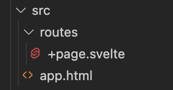

# JavaScript + Svelte.js

I dette kurset skal du lære å bruke Svelte.js til å gi en nettside mer funksjonalitet!

## Lag mappe for prosjektet

Brum terminalen (cmd) til å navigere til der du vil at det nye prosjektet/appen din skal ligge. Det er lurt å legge dette et sted i OneDrive.

## Setup

- I terminalen, skriv inn:
  - `npm create svelte@latest my-app`, men bytt ut "my-app" med det du vil at prosjektet/appen din skal hete.
  - Bruk piltaster + enter til å velge **skeleton project**
  - Velg **No**
  - Svar **nei/ingenting** til resten av spørsmålene
- Skriv `cd my-app` (eller hva appen din heter) i terminalvinduet
- Skriv `npm install`
- Skriv `npm run dev`

Etter at du har kjørt `npm run dev` har du nå en webserver kjørende på maksinen din. Gå til **localhost:5173** i nettleseren for å ta en titt.

## Kom i gang med Svelte.js

Nå er det på tide å kode litt! Åpne **Visual Studio Code!**

Inne i VSCode klikker du **file -> open folder** og finner fram til prosjektmappen din (eller åpne prosjektmappa på den måten du liker best).

Nå ser du denne filstrukturen på venstresiden

Men disse filene trenger du egentlig ikke å tenke på så mye. Vi skal bare jobbe i mappen som heter **src.**. Den ser slik ut:

I første omgang skal vi kun jobbe i filen som heter **+page.svelte**

Prøv å gjøre en endring i +page.svelte og sjekk at nettsiden endrer seg.

En viktig forskjell fra tidligere er at vi ikke trenger å bry oss om `<head>` og `<body>`, ettersom Svelta automatisk pakker det som finnes i +page.svelte inn i en template/mal.

Istedenfor å lage en egen style.css-fil slik vi har gjort tidligere, er det mer praktisk å bruke `style`\-tag inne i +page.svelte.

Du kan jo f.eks. legge inn in tekst med `p`\-tag'n og prøve å gi teksten en annen farge for å sjekke om alt fungerer som det skal. Da lager du en `style`\-tag og skriver `p { color: red; }`

I tillegg til HTML og CSS kan vi også bruke JavaScript!

For å skrive JavaScript, så må koden ligge inni en `` tag.

La oss sjekke om dette fungerer. Lag en `<script>` tag og lag en variabel:

Vi kan nå bruke variabelen vår på nettsiden ved å skrive `{navn}` et sted i HTML-en våres. F.eks.

I Python kunne du bare skrevet `navn = "Sondre"`, men legg merke til at JavaScript er litt mer kresen, så vi må faktisk spesifisere at vi skal lage en variabel, enten ved å skrive `const` eller `let`.

La oss se på et eksempel med en funksjon:

Først lager du en variabel som du kaller for `counter` som skal telle hvor mange ganger brukeren har trykket på en knapp. Deretter lager du en funksjon `increaseCounter` som øker counter med 1 hver gang funksjonen blir kalt.

I HTML-en lager du en `<button>`. Så kan du bruke `on:click` på knappen til å bestemme hva som skal skje når brukeren klikker på knappen. I dette tilfellet kalles funksjonen `increaseCounter`.

## Oppgave

Ved å bruke teknikkene du har lært hittil, sjekk om du kan lage et kontrollpanel for en ovn der du skal kunne øke og senke temperaturen på ovnen med å klikke på pluss og minus-knapper.

Bruk det du har lært tidligere om HTML og CSS til å få kontrollpanelet til å se pent ut.

Når du blir ferdig, jobber du med å lære mer om Svelte og JavaScript på [https://svelte.dev/tutorial/basics](https://svelte.dev/tutorial/basics).
